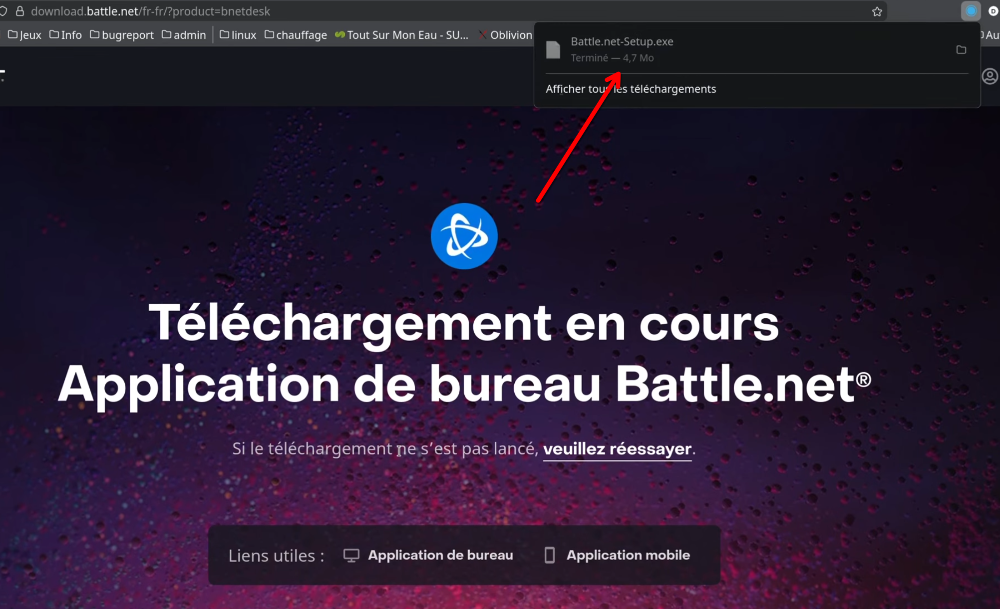
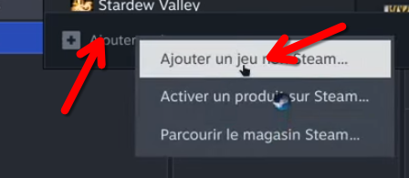
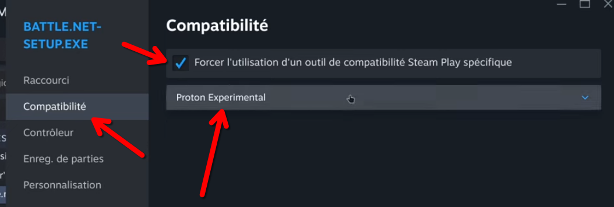
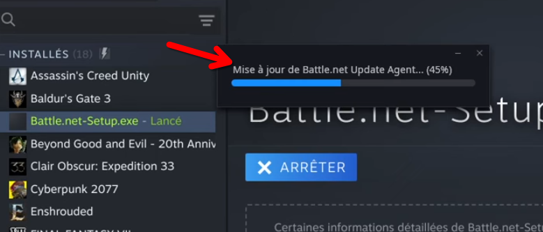
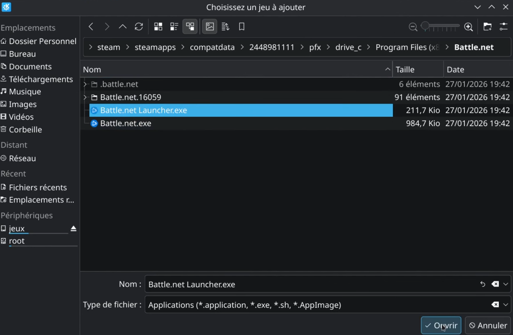
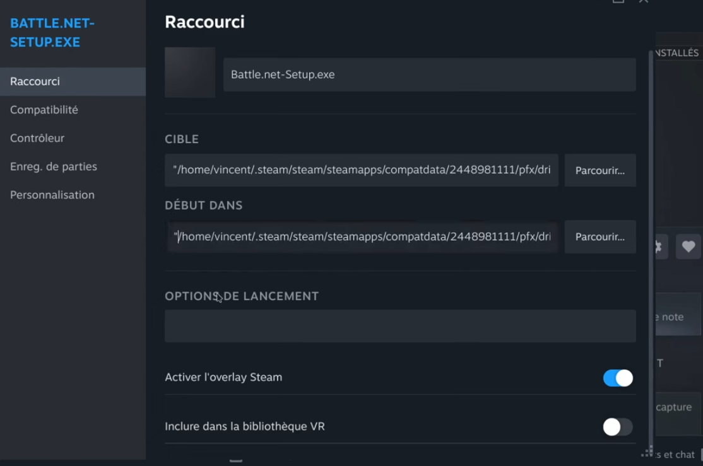
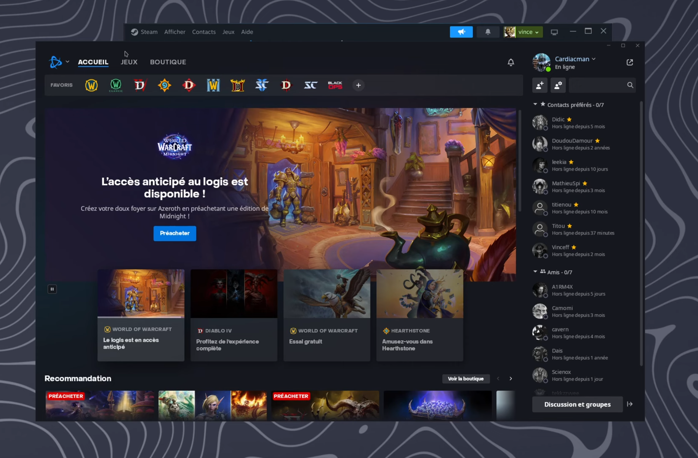

# Lancer un launcher **non-Steam** dans **Steam** sur **Linux** (exemple : Battle.net)

Ce guide explique comment installer puis lancer un launcher Windows (ici **Battle.net**) **via Steam + Proton** pour l’avoir directement dans ta bibliothèque Steam.

> ⚠️ Note : certains jeux derrière un launcher peuvent être limités par l’anti-cheat. Ici on traite **l’intégration du launcher**, pas la compatibilité de chaque jeu.
> Pour les débutants ça ne vous fera pas de mal de lire ça : [Wine, Proton et UMU : Comprendre Le Gaming sur Linux](https://github.com/Cardiacman13/Explications-proton-wine-et-umu) avant de commencer !

---


## Où Steam stocke le préfixe Proton (“faux Windows”) ?

Quand tu lances un `.exe` avec Proton, Steam crée un préfixe Windows (un faux `C:`) dans `compatdata/`.

### Steam natif (package distro)
```txt
~/.local/share/Steam/steamapps/compatdata/
````

### Steam Flatpak

```txt
~/.var/app/com.valvesoftware.Steam/data/Steam/steamapps/compatdata/
```

Dans `compatdata/`, chaque appli a un dossier numérique (ex : `2448981111`) contenant :

```txt
pfx/drive_c/...
```

---

## Tutoriel pas à pas (Battle.net)

### 1) Télécharger le launcher

Télécharge l’installeur depuis le site Blizzard :

* `Battle.net-Setup.exe`



---

### 2) Ajouter l’installeur dans Steam

Dans Steam :

1. Clique sur **➕ Ajouter un jeu** (en bas à gauche)
2. Clique sur **Ajouter un jeu non-Steam…**
3. Sélectionne `Battle.net-Setup.exe` dans ton dossier **Téléchargements**



---

### 3) Forcer Proton

Dans ta bibliothèque Steam, tu verras `Battle.net-Setup.exe`.

1. Clic droit → **Propriétés**
2. Onglet **Compatibilité**
3. Coche **Forcer l’utilisation d’un outil de compatibilité Steam Play spécifique**
4. Choisis **Proton Experimental**



---

### 4) Lancer l’installeur et installer Battle.net

1. Clique sur **Jouer**
2. Installe Battle.net comme sur Windows
3. Une fois installé : **ferme complètement Battle.net**



---

### 5) Retrouver l’exe installé dans le préfixe Proton

Après l’installation, l’exe àà cibler n’est plus l'installateur dans Téléchargements mais le launcher, il est dans le `drive_c` du préfixe Proton.

Chemin typique (dans le préfixe) :

```txt
.../compatdata/<ID>/pfx/drive_c/Program Files (x86)/Battle.net/
```

ID dépend du jeu.

Exécutables possibles :

* `Battle.net Launcher.exe` (souvent le meilleur choix)
* `Battle.net.exe`



---

### 6) Remplacer la **Cible** et le **Début dans** dans Steam

Maintenant on transforme l’entrée Steam “Battle.net-Setup.exe” en “Battle.net” (le launcher installé).

1. Clic droit sur `Battle.net-Setup.exe` → **Propriétés**
2. Onglet **Raccourci**
3. Modifie :

#### ✅ CIBLE (Target)

➡️ Mets **le chemin complet vers l’exe** installé, **entre guillemets**. N'oubliez surtout pas les guillemets.

Exemple (Steam natif) :

```txt
"/home/<user>/.local/share/Steam/steamapps/compatdata/2448981111/pfx/drive_c/Program Files (x86)/Battle.net/Battle.net Launcher.exe"
```

#### ✅ DÉBUT DANS (Start in)

➡️ Mets **le dossier parent** qui contient l’exe, **entre guillemets**.

Exemple :

```txt
"/home/<user>/.local/share/Steam/steamapps/compatdata/2448981111/pfx/drive_c/Program Files (x86)/Battle.net"
```



> Pourquoi les guillemets `"` ?
> Parce qu’il y a des espaces (`Program Files (x86)`), sinon Steam/Proton peut mal interpréter le chemin.

---

### 7) Lancer : terminé ✅

Clique sur **Jouer** : Battle.net se lance depuis Steam.



---

## Bonus : ajouter une belle jaquette / bannière / icône (SteamGridDB)

Tu peux récupérer des covers, headers, logos, icônes ici :

* [https://www.steamgriddb.com/](https://www.steamgriddb.com/)

### Important : emplacement de l’icône

Pour Steam, **mets le fichier d’icône dans le répertoire de destination du launcher**
(ex : le dossier où se trouve `Battle.net Launcher.exe`).

✅ Exemple :

```txt
.../Program Files (x86)/Battle.net/icon.png
```

> Si tu mets les icônes ailleurs, Steam peut refuser / ne pas les accepter (selon le sélecteur de fichiers / permissions / sandbox).

---

## Bonus vidéo

Vidéo démonstration :

* [https://www.youtube.com/watch?v=E67kHAupwaA](https://www.youtube.com/watch?v=E67kHAupwaA)

---

## Problèmes fréquents

### “Rien ne se lance” après modification

* Vérifie que **Compatibilité → Proton Experimental** est toujours forcé
* Vérifie les **guillemets** dans **Cible** et **Début dans**
* Teste l’autre exe : `Battle.net.exe` au lieu de `Battle.net Launcher.exe`

---
## Il y a toujours des exceptions !

Selon le launcher il faudra parfois chercher un peu plus, mais normalement ils fonctionne TOUS, si vous avez du mal, n'hésitez pas à mettre un commentaire sous la vidéo de démonstatration et je vous aiderai.

---

## Résumé

1. Télécharger `Battle.net-Setup.exe`
2. Steam → Ajouter un jeu non-Steam → sélectionner l’installeur
3. Forcer **Proton Experimental**
4. Jouer → installer → fermer Battle.net
5. Remplacer **Cible** et **Début dans** vers le préfixe `compatdata/<ID>/pfx/drive_c/...` pensez aux ""
6. Jouer ✅

```
